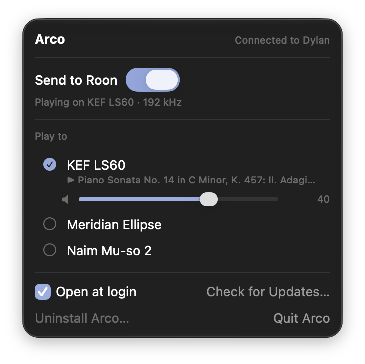

# Arco

Play Apple Music on your Roon zones, from a small app in your Mac's menu bar.

Arco takes what the Music app plays on your Mac and hands it to Roon as a live source, with the
title, artist, album and cover of each track. Roon does the rest: your zones, your DSP, your endpoints — including the
ones that only speak RAAT.

<p align="center"></p>

> **Status:** beta. It works well in daily use here; expect rough edges, and please report them.

## What you get

- **Any Roon zone, from the menu bar.** Pick the zone, switch on *Send to Roon*, press play in Music. The
  Roon app doesn't need to be open — a laptop on your lap with Music is enough.
- **A clock per track.** Each track arrives in Roon at its own sample rate: a 44.1 kHz track plays at 44.1, the next
  96 kHz track at 96. The menu shows the rate Roon receives.
- **Gapless** between tracks at the same rate — a live album or a classical work plays through without a seam.
- **What's playing, in Roon:** title, artist, album and cover per track. Roon's play, pause, next and previous buttons
  work, and so does the zone's volume, in Roon or in Arco's menu.
- **Updates** arrive through the app itself (Sparkle), as signed and notarized packages.

## Requirements

- macOS 14 Sonoma or later, on Apple silicon or Intel — so far tested on macOS 27 with Apple silicon; reports from
  other versions and from Intel Macs are very welcome
- A Roon Core on the same network (Roon 2.x)
- The Music app on the Mac, with an Apple Music subscription
- For the clock per track: in Music › Settings › Playback, set *Audio Quality* to **Lossless** (up to 24-bit/192 kHz
  for hi-res).

## Install

1. Download `Arco-<version>.pkg` from [Releases](https://github.com/renebouwmeester/arco/releases) and open it.
2. The installer puts **Arco** in Applications and its **audio driver** in `/Library/Audio/Plug-Ins/HAL`. It asks for
   an administrator password, and restarts the Mac's audio for a moment.
3. Arco opens in the menu bar with a short *Get started* list:
   - **Audio driver** — installed by the package.
   - **Microphone access** — Arco reads its *own* audio output back (the music Music plays to it). macOS files that
     under the microphone; Arco never listens to a microphone.
   - **Control Music** — to follow what plays and pass on Roon's buttons.
   - **Enabled in Roon** — in Roon, open *Settings › Extensions* and press *Enable* next to *Arco on <your Mac>* — once
     for each Mac (Roon remembers it after that, also through updates).

The list goes away once everything is in place. *Open at login* is a checkbox in the menu.

## Use

1. Pick a zone under *Play to*.
2. Switch on **Send to Roon**. Arco becomes the Mac's sound output.
3. Press play in Music.

Switch it off and the Mac gets its own output back. Switching zones while it plays moves the music to the new zone.

## Good to know

- Roon plays a few seconds behind the Music app: Roon keeps a buffer of the live stream, as it does for any source.
- Next and previous take a few seconds to be heard: Roon starts a new stream and has to buffer it as the music comes in
  (a file from Qobuz it can fetch ahead; a live source it can't).
- A change of sample rate between two tracks is a fresh start in Roon — gapless holds between tracks at the same rate.
  The Music app itself pauses there to change the clock.
- Roon's progress bar counts through a stretch of tracks at the same rate rather than the current track alone; the title,
  artist and cover change with each track.
- At 192 kHz a stretch holds about an hour of music (a WAV file's limit); a longer album continues in a new one, starting
  between two tracks.
- Hi-res needs a steady connection from Roon to the endpoint: a speaker on a weak wifi link may drop out at 192 kHz
  (in Roon, *Device Setup › Max Sample Rate* helps).
- Seeking within a track in the Music app isn't passed on to Roon.
- While *Send to Roon* is on, Arco is the Mac's sound output: sound from other apps (a video in the browser) goes to
  Roon too. Sound effects follow *System Settings › Sound › Play sound effects through* — set it to the Mac's own
  speakers and they stay on the Mac.

## Uninstall

Choose **Uninstall Arco…** in the menu. It removes the app and the driver (with an administrator password), restarts
the Mac's audio, and clears Arco's settings, log and permissions. Remove the extension in Roon's *Settings ›
Extensions* as well.

## Problems and ideas

- Arco keeps a log — **Show Log** in the menu opens it in Finder (`~/Library/Logs/Arco/arco.log`); it helps a lot with a bug report. It contains track titles and
  local network addresses — look it over before you share it.
- [Report a problem or suggest something](https://github.com/renebouwmeester/arco/issues/new/choose), or ask in
  [Discussions](https://github.com/renebouwmeester/arco/discussions).

## How it works

- **The Arco output** — a virtual audio device (an AudioServerPlugIn). Music plays to it; nothing leaves your Mac until
  Arco sends it on.
- **The bridge** — Arco reads that output back (bit for bit what Music produced), cuts it into runs of tracks at the
  same rate and serves them to your Roon Core over your local network.
- **The extension** — Arco registers with your Roon Core and uses Roon's audio input API to play the stream on the zone
  you pick, with the information of each track. Roon's transport buttons come back to Arco, which passes them on to
  the Music app.

## Building from source

Needs Xcode and [XcodeGen](https://github.com/yonaskolb/XcodeGen) (`brew install xcodegen`).

```sh
./build.sh          # generate the project, build, and run Arco from build/
./build.sh driver   # build the audio driver; install it with: sudo build/driver/install.sh
./build.sh check    # build only
```

`release.sh` builds the signed and notarized package, `publish.sh` puts it on GitHub (both need the maintainer's
certificates and keys). The icons are drawn by `Design/make-icons.swift`.

## License

Apache License 2.0 — see [LICENSE](LICENSE).

Arco is an independent project. It is not affiliated with or endorsed by Roon Labs or Apple. Roon and Apple Music are
trademarks of their respective owners.
